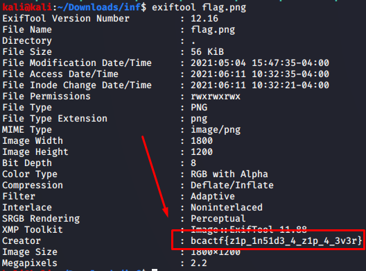

1) `unzip flag.zip` gives us "999.zip", unzip that gives "998.zip", and so on and so forth. i wrote a simple bash script to automate this

```bash
#!/bin/bash
unzip flag.zip
for i in {999..0}
do
 unzip $i.zip
done
```

or we can use

```bash
while [ "find . -type f -name '*.zip' | wc -l" -gt 0 ]; do find -type f -name "*.zip" -exec unzip -- '{}' ; -exec rm -- '{}' ;; done
```
2) After 999 unzips we get [flag.png](flag.png).  This is a fake flag, and the link included is also a troll link.  Taking a look at it with `strings flag.png` shows some text mentioning exiftool and flag also if we run it with less command.

```bash
exiftool flag.png
``` 
gives us the flag
OR

```bash
string flag.png | less
```
does the same



Flag: ```bcactf{z1p_1n51d3_4_z1p_4_3v3r}```
