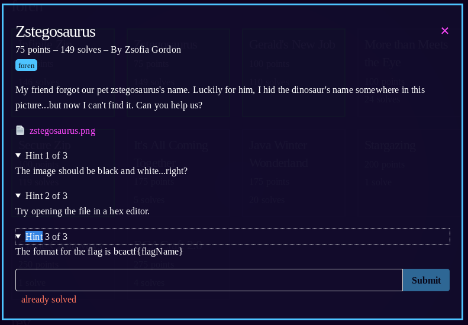

1) Based on the hint, the question probably wants us to use zsteg

2) ```zsteg zstegosaurus.png```

gives output:
```bash
b1,r,lsb,xy         .. text: "h15_n@m3_i5nt_g3rard"
b4,rgb,msb,xy       .. text: ["w" repeated 10 times]
```

Flag: ```bcactf{h15_n@m3_i5nt_g3rard}```