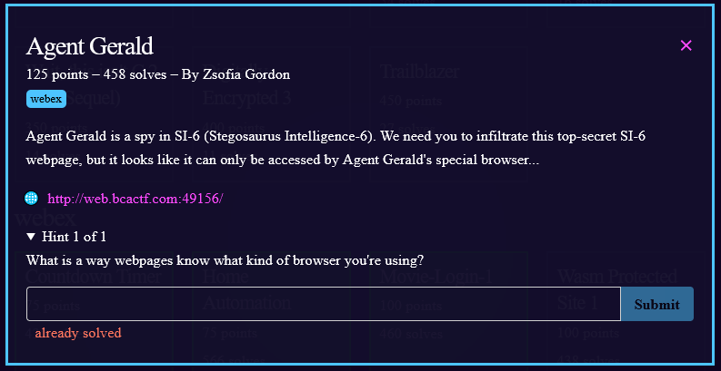
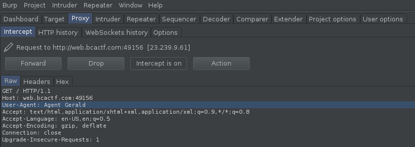

1) Visiting the page gives us:


2) The text mentions using a special browser.  Websites know what browser or [user agent](https://developer.mozilla.org/en-US/docs/Web/HTTP/Headers/User-Agent) you are using based on your get request to the page.

3) we can change that user agent value using [burpsuite](https://portswigger.net/burp)


4) And we get the flag! 

Flag: ```bcactf{y0u_h@ck3d_5tegos@urus_1nt3lligence}```


# 2nd Method

# Agent Gerald:webex:125pts
Agent Gerald is a spy in SI-6 (Stegosaurus Intelligence-6). We need you to infiltrate this top-secret SI-6 webpage, but it looks like it can only be accessed by Agent Gerald's special browser...  
[http://web.bcactf.com:49156/](http://web.bcactf.com:49156/)  
  
Hint 1 of 1  
What is a way webpages know what kind of browser you're using?  

# Solution
When you visit the site, a mysterious page appears.  
Welcome to the Stegosaurus Intelligence-6 Homepage  
[site.png](site.png)  
User-Agent seems to be suspicious from the problem name.
Set User-Agent to `Gerald` and try to get it as follows.
```bash
$ curl -H "User-Agent: Gerald" http://web.bcactf.com:49156/
<!DOCTYPE html>
        <html>
            <head>
            </head>
            <body>
                <h1>Welcome to the Stegosaurus Intelligence-6 Homepage</h1>
                <h2>Are you Agent Gerald?</h2>
                </img>
                   <h4> Welcome, Agent Gerald! Your flag is: bcactf{y0u_h@ck3d_5tegos@urus_1nt3lligence} </h4>
            </body>
        </html>
```
flag was found.
Flag: ``` bcactf{y0u_h@ck3d_5tegos@urus_1nt3lligence}```