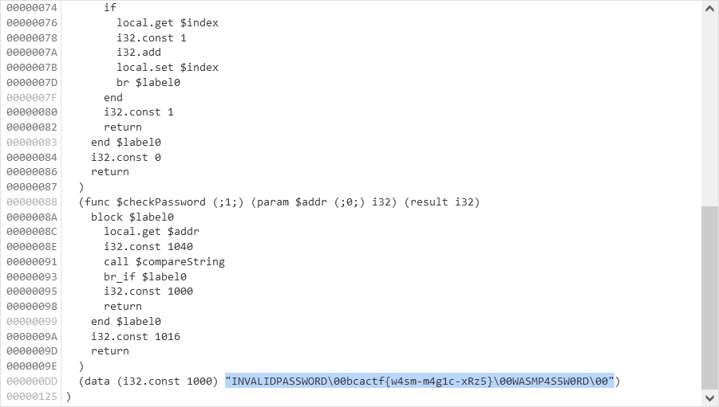

# Wasm Protected Site 1:webex:100pts
- Check out my super safe website! Enter the password to get the flag  

[http://web.bcactf.com:49157/](http://web.bcactf.com:49157/)  
  
Hint 1 of 1  
How does the Web Assembly check the password you entered, and what is it looking for?  

# Solution
When I visit the site, it seems that the login form is running in wasm.
Wasm Protected Site 1  
[site.png](site/site.png)  
Looking at the network, it seems that `http://web.bcactf.com:49157/code.wasm` is the main body (you can read js).
Wget and look at the contents with strings.  
```bash
$ wget http://web.bcactf.com:49157/code.wasm

$ strings code.wasm
memory
compareString
checkPassword
5INVALIDPASSWORD
bcactf{w4sm-m4g1c-xRz5}
WASMP4S5W0RD
name
compareString
checkPassword
str1
str2
index
addr
```
The flag was written.
You may look at the debugger.
  

Flag: ```bcactf{w4sm-m4g1c-xRz5}```